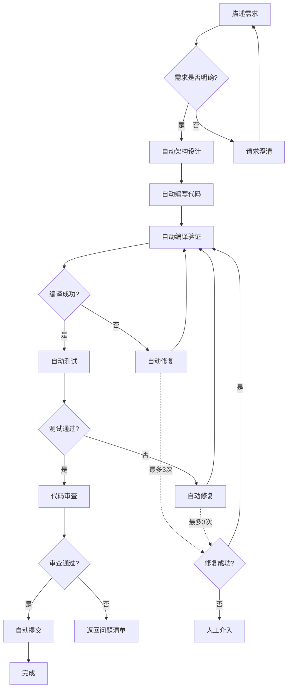

# PortMaster 全自动化开发流程 - 快速开始指南

**版本**: v1.0
**适用对象**: 开发者、测试人员、AI助手
**目标**: 10分钟内启动全自动化开发流程

---

## 🚀 快速启动（3步完成）

### 步骤1: 描述需求（1分钟）

**方式A: 自然语言描述**
```
向Claude Code描述您的需求，例如：
"我需要修复可靠传输模式下的数据丢失问题"
"我要为串口通信增加XON/XOFF软件流控支持"
"帮我优化UI响应速度，消除卡顿"
```

**方式B: 使用需求模板**
```markdown
## 需求描述
【具体描述要实现的功能或要修复的问题】

## 预期目标
【明确期望达成的技术目标】

## 验收标准
【如何判断任务完成】

## 约束条件
【是否需要真实硬件、性能要求等】
```

### 步骤2: 启动自动化流程（1分钟）

**命令行方式**:
```bash
# 完整自动化流程（推荐）
python auto_dev_workflow.py --requirement "您的需求描述"

# 或使用Claude Code的自定义命令
/zcf:workflow
```

**Claude Code方式**:
```
直接对Claude Code说：
"请按照全自动化开发流程实施方案，开始自动开发和测试"
```

### 步骤3: 监控进度并接收结果（自动完成）

**自动执行内容**:
```
✅ 需求分析      → 生成功能需求清单
✅ 架构设计      → 设计模块和接口
✅ 代码实现      → 自动编写源码
✅ 自动测试      → 单元/集成/系统测试
✅ 自动修复      → 识别并修复问题（最多3次）
✅ 版本提交      → Git提交并推送
```

**实时查看日志**:
```bash
# 主流程日志
tail -f auto_dev_workflow.log

# 测试日志
tail -f test_execution.log

# 修复日志
tail -f auto_fix.log
```

---

## 📋 执行流程一览



---

## ⚙️ 配置文件说明

**配置文件位置**: `auto_dev_config.json`

**关键配置项**:
```json
{
  "workflow": {
    "max_iterations": 20,           // 最大迭代次数
    "max_fix_attempts": 3,          // 最大自动修复尝试次数
    "enable_auto_commit": true,     // 是否自动提交到Git
    "enable_performance_check": true // 是否启用性能检查
  },
  "testing": {
    "coverage_threshold": 90,              // 代码覆盖率阈值(%)
    "performance_regression_threshold": 20, // 性能回归阈值(%)
    "enable_stress_testing": false         // 是否启用压力测试
  },
  "quality": {
    "enable_static_analysis": true,  // 是否启用静态分析
    "enable_code_review": true,      // 是否启用AI代码审查
    "enforce_zero_warnings": true    // 是否强制0警告
  }
}
```

**快速调整**:
```bash
# 仅测试模式（不修改代码）
python auto_dev_workflow.py --mode test-only

# 仅修复模式（基于错误日志）
python auto_dev_workflow.py --mode fix-only --error-log "error.log"

# 跳过性能检查（加快速度）
python auto_dev_workflow.py --skip-performance-check
```

---

## 🎯 自动化测试说明

### 测试层次

**Level 1: 单元测试（自动生成并执行）**
- Transport层：串口/并口/USB/网络/回路
- Protocol层：CRC32/FrameCodec/ReliableChannel
- UI层：状态管理/按钮控制/显示格式

**Level 2: 集成测试（自动执行）**
- Transport + Protocol组合测试
- Protocol + UI状态同步测试
- 端到端流程验证

**Level 3: 系统测试（自动执行）**
- 完整功能流程测试
- 性能基准测试
- 稳定性测试（长时间运行）

**Level 4: 回归测试（每次变更自动执行）**
- 全量测试套件
- 性能对比
- 兼容性验证

### 测试覆盖率要求

```
强制要求：
✅ 行覆盖率    ≥ 90%
✅ 分支覆盖率  ≥ 85%
✅ 函数覆盖率  ≥ 95%
✅ 无内存泄漏
✅ 0 error 0 warning
```

**未达标处理**:
- 自动生成补充测试用例
- 标记未覆盖代码区域
- 建议添加测试场景

---

## 🛠️ 自动修复机制

### 错误分类与修复策略

**编译错误（自动修复率: 95%）**
```
缺少头文件      → 自动搜索并添加#include
未定义引用      → 自动添加源文件到项目
类型不匹配      → 自动类型转换或修正
链接错误        → 检查依赖库并配置
```

**运行时错误（自动修复率: 80%）**
```
空指针访问      → 添加nullptr检查
数组越界        → 添加边界检查
内存泄漏        → 添加资源释放代码
断言失败        → 分析断言条件并修正
```

**逻辑错误（自动修复率: 60%）**
```
状态转换错误    → 修正状态转换表或调整转换序列
数据截断        → 调整缓冲区大小或数据类型
业务逻辑错误    → 基于测试失败原因修正算法
```

### 修复验证循环

```
检测错误 → 分析原因 → 应用修复 → 重新编译 → 重新测试
    ↑                                              ↓
    └──────────────── 验证失败 ←───────────────────┘
                    （最多3次）
                         ↓ 3次后仍失败
                    【人工介入】
```

### 修复失败处理

**触发人工介入的条件**:
1. 3次自动修复尝试均失败
2. 修复进入死循环（重复修复同一错误）
3. 修复引入新的错误
4. 检测到安全风险

**人工介入时提供的信息**:
```
✅ 错误诊断报告
✅ 已尝试的修复策略
✅ 失败原因分析
✅ 建议的修复方案
✅ 相关代码位置和上下文
```

---

## 📊 质量保证检查点

### 代码质量检查

**静态分析（自动执行）**
```bash
✅ cppcheck       # C++静态分析
✅ clang-tidy     # LLVM代码检查
✅ VS分析         # Visual Studio内置分析
```

**AI代码审查（自动调用agents）**
```bash
✅ architect-reviewer  # 架构审查（SOLID原则）
✅ code-reviewer       # 代码质量审查
✅ security-auditor    # 安全审查（如有需要）
```

### 性能基准测试

**性能指标监控**:
```
传输吞吐量:
  串口  ≥ 115200 bps
  网络  ≥ 10 MB/s

UI响应:
  响应时间  ≤ 100ms
  刷新率    ≥ 30 FPS

内存占用:
  峰值内存  ≤ 100 MB
  无内存泄漏
```

**性能回归检测**:
- 对比修改前后性能指标
- 性能下降 > 20% 触发警告
- 自动生成性能分析报告

### 文档同步检查

**自动检测需要更新的文档**:
```
API变更    → docs/API文档.md
工作流变更  → CLAUDE.md
功能新增   → README.md, 用户手册
架构变更   → docs/架构设计.md
```

**未更新文档处理**:
- 提醒需要更新的文档列表
- 自动生成文档更新草稿
- 等待确认后自动更新

---

## 🔄 版本控制流程

### 自动提交规范

**Conventional Commits格式**:
```bash
类型(范围): 简短描述

详细说明（可选）

🤖 Generated with [Claude Code](https://claude.com/claude-code)
Co-Authored-By: Claude <noreply@anthropic.com>
```

**类型枚举**:
```
feat:     新功能
fix:      Bug修复
docs:     文档更新
refactor: 代码重构
test:     测试相关
chore:    构建/工具变更
perf:     性能优化
style:    代码格式调整
```

### 自动推送策略

**推送检查清单**:
```
✅ 编译成功（0 error 0 warning）
✅ 所有测试通过
✅ 覆盖率达标（≥90%）
✅ 代码审查通过
✅ 无性能回归
✅ 文档已同步
```

**全部通过后自动执行**:
```bash
git add -A
git commit -m "类型: 描述"
git push PortMaster HEAD
git tag "save-$(date +%Y%m%d-%H%M%S)"
git push --tags
```

---

## 🎪 人工介入场景

### 何时需要人工介入

| 场景 | 触发条件 | 处理方式 |
|------|---------|---------|
| **需求不明确** | AI无法理解需求 | 请求澄清具体需求 |
| **架构冲突** | 新需求与现有架构冲突严重 | 提供多个架构方案供选择 |
| **修复失败** | 3次自动修复后仍失败 | 提供诊断报告和修复建议 |
| **测试失败** | 3次修复后测试仍不通过 | 提供失败分析和改进建议 |
| **硬件测试** | 需要真实打印机设备 | 生成测试步骤文档 |
| **性能严重降级** | 性能下降>20% | 提供性能分析报告 |
| **安全风险** | 检测到潜在安全问题 | 立即停止并报告 |

### 人工介入操作指南

**步骤1: 查看详细信息**
```bash
# 查看最新的问题报告
cat intervention_required_[时间戳].md

# 查看诊断日志
tail -n 100 auto_dev_workflow.log
```

**步骤2: 选择操作**
```
1. [手动修复] → 人工修改代码后运行 --mode resume
2. [调整方案] → 修改需求或配置后重新启动
3. [跳过问题] → 标记为已知问题，继续其他任务
4. [终止流程] → 停止自动化流程
```

**步骤3: 恢复自动化**
```bash
# 手动修复完成后恢复
python auto_dev_workflow.py --mode resume --from-checkpoint

# 调整需求后重新开始
python auto_dev_workflow.py --requirement "调整后的需求"
```

---

## 📈 进度监控

### 实时状态查看

**命令行方式**:
```bash
# 查看当前进度
python workflow_status.py

# 输出示例：
# ========================================
# 自动化开发流程进度
# ========================================
# 当前阶段: [4/6] 自动测试
# 当前任务: 运行集成测试
# 已完成: 65%
# 预计剩余时间: 8分钟
# ========================================
```

**Web界面方式**（可选）:
```bash
# 启动进度监控Web界面
python progress_dashboard.py

# 浏览器访问: http://localhost:8080
```

### 日志查询

**按类型查询**:
```bash
# 查看错误日志
grep "ERROR" auto_dev_workflow.log

# 查看警告日志
grep "WARNING" auto_dev_workflow.log

# 查看修复记录
grep "FIX" auto_fix.log
```

**按时间查询**:
```bash
# 查看最近10分钟的日志
find . -name "*.log" -mmin -10 -exec tail -f {} +
```

---

## 🧪 测试场景示例

### 示例1: 自动修复编译错误

**场景**: 添加新功能导致编译失败

```
1. 代码变更后触发自动编译
   → 检测到编译错误: 缺少头文件"Transport/SerialTransport.h"

2. 自动修复系统启动
   → 搜索项目中的头文件位置
   → 在源文件顶部添加: #include "Transport/SerialTransport.h"

3. 重新编译验证
   → 编译成功: 0 error, 0 warning

4. 自动测试验证
   → 运行相关单元测试
   → 所有测试通过

5. 自动提交
   → git commit -m "fix: 添加缺失的头文件引用"
   → git push
```

### 示例2: 自动修复运行时错误

**场景**: 程序运行时崩溃

```
1. 运行测试时程序崩溃
   → 错误捕获: Access violation at 0x00000000
   → 堆栈分析: CPortMasterDlg::OnBnClickedSend() line 523

2. 错误诊断
   → 定位到: m_reliableChannel->SendData(data)
   → 分析: m_reliableChannel 可能为nullptr

3. 自动修复
   → 在调用前添加空指针检查:
   if (m_reliableChannel == nullptr) {
       AfxMessageBox(_T("可靠传输通道未初始化"));
       return;
   }

4. 重新编译和测试
   → 编译成功
   → 测试通过（无崩溃）

5. 回归测试
   → 验证修复未引入新问题
   → 全部通过

6. 自动提交
   → git commit -m "fix: 添加可靠传输通道空指针检查"
```

### 示例3: 自动生成并执行测试

**场景**: 新增功能需要测试覆盖

```
1. 新增功能: XON/XOFF流控支持
   → 代码实现完成

2. AI自动生成测试用例
   → 单元测试: test_xon_xoff_flow_control()
   → 集成测试: test_serial_with_xon_xoff()
   → 边界测试: test_xon_xoff_edge_cases()

3. 自动执行测试
   → 单元测试: 通过
   → 集成测试: 通过
   → 边界测试: 通过

4. 覆盖率检查
   → 新增代码覆盖率: 95%
   → 整体覆盖率: 91% (达标)

5. 性能测试
   → XON/XOFF流控下吞吐量: 105 KB/s
   → 无性能回归

6. 自动提交
   → 提交代码和测试用例
   → 更新文档
```

---

## 🏆 最佳实践

### DO（推荐做法）

✅ **明确描述需求**: 提供清晰、具体的功能描述和验收标准
✅ **信任自动化流程**: 让AI完成单元测试、集成测试、修复等任务
✅ **定期查看日志**: 了解流程进度和潜在问题
✅ **及时响应人工介入**: 当系统请求澄清时快速响应
✅ **保持配置文件更新**: 根据项目需要调整自动化配置
✅ **定期审查测试覆盖**: 确保新功能有充分的测试
✅ **监控性能指标**: 关注性能回归情况

### DON'T（避免做法）

❌ **不要模糊需求**: 避免使用"可能"、"或许"等不确定词汇
❌ **不要跳过测试**: 即使是小修改也应该运行完整测试
❌ **不要忽略警告**: 编译警告可能隐藏潜在问题
❌ **不要手动修改自动生成的测试**: 这可能导致测试失效
❌ **不要禁用代码审查**: AI审查可以发现人类容易忽略的问题
❌ **不要在修复失败后强行提交**: 应该等待修复成功或人工介入
❌ **不要忽视性能回归**: 性能问题会累积并影响用户体验

---

## 🆘 故障排查速查表

### 问题: 自动化流程卡死不动

**症状**: 长时间无日志输出，进程存在但无响应

**解决步骤**:
```bash
# 1. 检查进程状态
tasklist | findstr python
tasklist | findstr PortMaster

# 2. 查看最后日志
tail -n 50 auto_dev_workflow.log

# 3. 强制终止并恢复
taskkill /F /IM python.exe /FI "WINDOWTITLE eq auto_dev*"
python auto_dev_workflow.py --mode resume --from-checkpoint
```

### 问题: 编译一直失败

**症状**: 重复编译但始终有错误

**解决步骤**:
```bash
# 1. 清理构建目录
cmd.exe /c "clean_build.bat"

# 2. 检查Visual Studio环境
where devenv.exe
where msbuild.exe

# 3. 手动编译验证
cmd.exe /c "autobuild_x86_debug.bat"

# 4. 查看详细编译日志
cat msbuild_debug.log | grep "error"
```

### 问题: 测试随机失败

**症状**: 同一个测试有时通过有时失败

**解决步骤**:
```bash
# 1. 运行多次测试统计
python debug_random_failures.py --test "测试名称" --iterations 50

# 2. 检查是否有时序问题
# 查找sleep/delay/timeout相关代码

# 3. 检查是否有资源竞争
# 查找共享资源访问

# 4. 增加测试稳定性
# 添加重试机制或调整超时时间
```

### 问题: 自动修复进入死循环

**症状**: 反复修复同一个错误

**解决步骤**:
```bash
# 1. 检测修复历史
python detect_fix_loop.py

# 2. 查看修复策略
cat fix_strategies_used.log

# 3. 手动介入
# 分析为什么自动修复不成功
# 提供正确的修复方案

# 4. 更新修复策略库
# 添加新的修复模式
```

---

## 📚 参考资源

### 核心文档

| 文档名称 | 描述 | 位置 |
|---------|------|------|
| **完整实施方案** | 详细的系统设计和实现 | `docs/PortMaster_全自动化AI驱动开发系统实施方案.md` |
| **项目开发文档** | PortMaster功能需求和规格 | `docs/PortMaster 项目开发.md` |
| **CLAUDE.md** | Claude Code工作流程指南 | `CLAUDE.md` |
| **修订记录** | 历史问题和修复记录 | `修订工作记录*.md` |

### 工具脚本

| 脚本名称 | 功能 | 位置 |
|---------|------|------|
| auto_dev_workflow.py | 主控自动化流程 | 根目录 |
| autonomous_fix_controller.py | 自动修复控制器 | 根目录 |
| enhanced_error_capture.py | 错误捕获系统 | 根目录 |
| test_data_generator.py | 测试数据生成器 | TestTools/ |

### 测试工具

| 工具名称 | 功能 | 位置 |
|---------|------|------|
| AutoTest.exe | 可靠传输协议测试 | AutoTest/ |
| TransportUnitTest.exe | Transport层单元测试 | TestTools/ |
| ProtocolUnitTest.exe | Protocol层单元测试 | TestTools/ |

---

## 🎯 下一步计划

基于本快速开始指南，您可以：

### 立即执行（今天）
1. ✅ 阅读完本文档
2. ✅ 配置`auto_dev_config.json`
3. ✅ 运行第一个自动化任务
4. ✅ 查看执行日志和结果

### 短期目标（本周）
1. 📋 完善AutoTest工具
2. 📋 实现Transport层单元测试
3. 📋 建立基础的CI/CD流程
4. 📋 优化自动修复策略

### 长期目标（本月）
1. 🎯 完成所有层次的自动化测试工具
2. 🎯 建立完整的错误模式库
3. 🎯 实现90%+的自动修复成功率
4. 🎯 实现完全自动化的开发-测试-部署流程

---

## 💡 温馨提示

1. **首次使用建议**: 从小功能或Bug修复开始，熟悉流程后再处理复杂需求
2. **保持环境整洁**: 定期清理临时文件、日志和备份
3. **定期更新工具**: 关注自动化工具的更新和改进
4. **积累经验**: 记录成功案例和失败案例，持续优化
5. **团队协作**: 与其他开发者分享自动化经验，共同改进

---

## 📞 获取帮助

遇到问题时：

1. **查看日志**: 90%的问题可以从日志中找到答案
2. **参考文档**: 详细实施方案包含更多技术细节
3. **检查配置**: 确认配置文件设置正确
4. **人工介入**: 不要犹豫，必要时请求人工支持

---

**祝您使用愉快！全自动化AI驱动开发系统将显著提升您的开发效率！** 🚀
